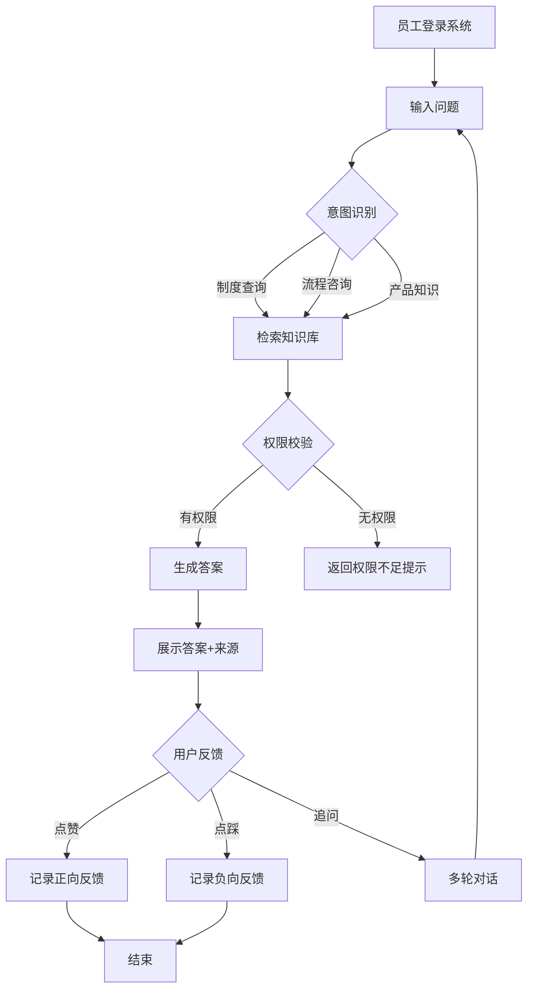
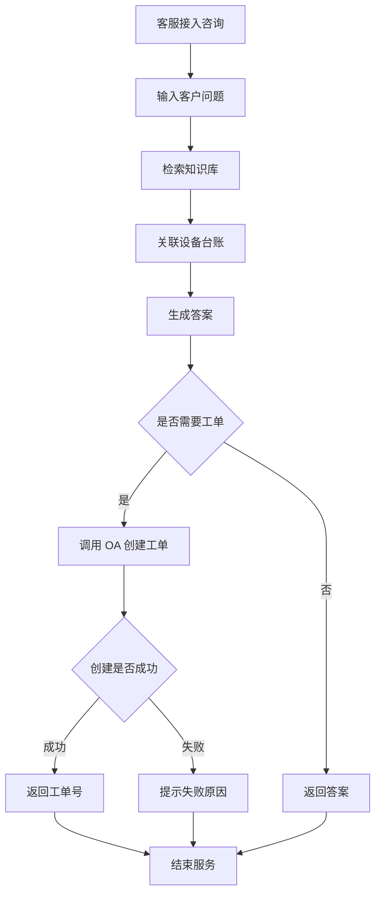
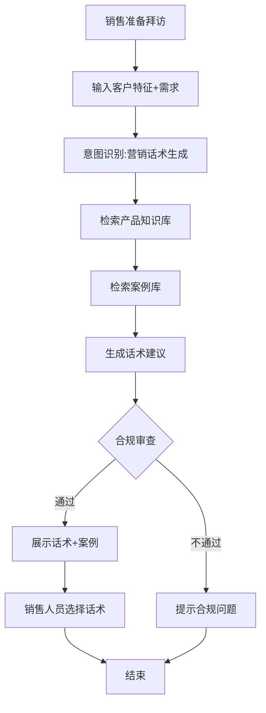
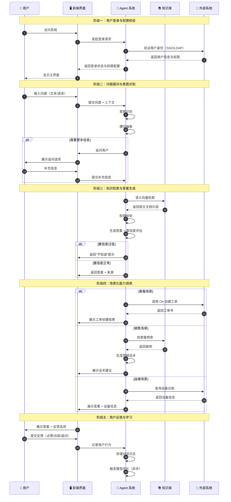
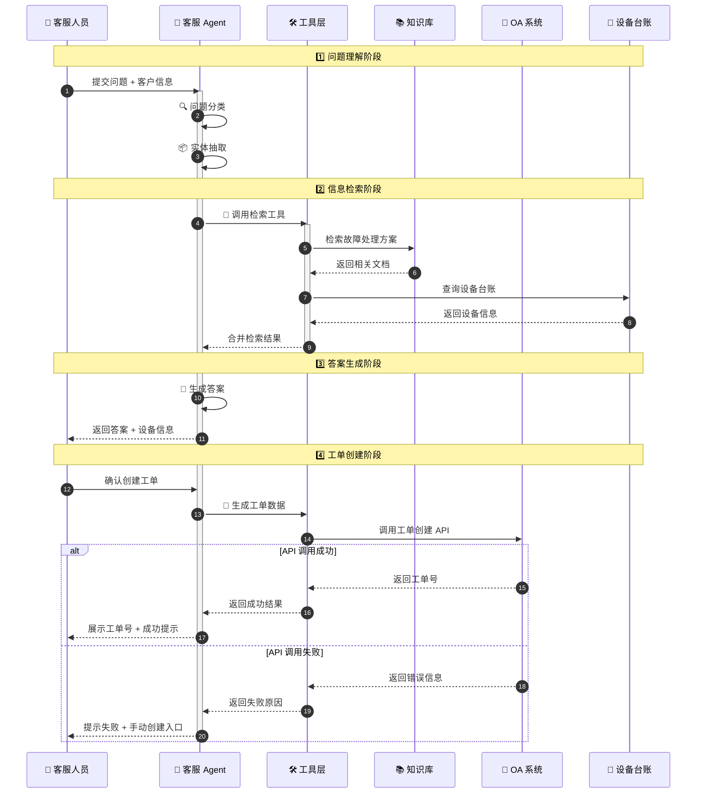
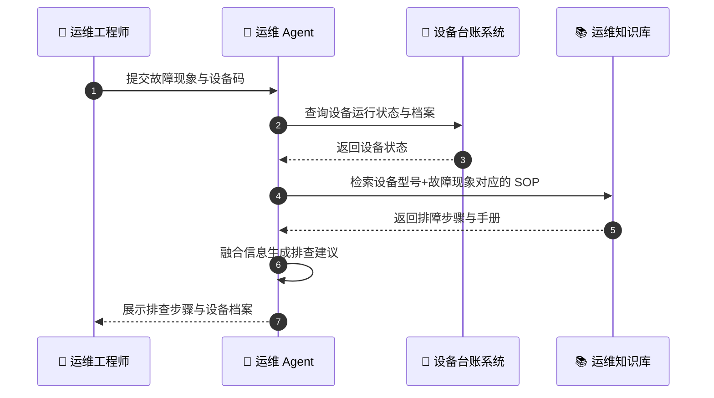
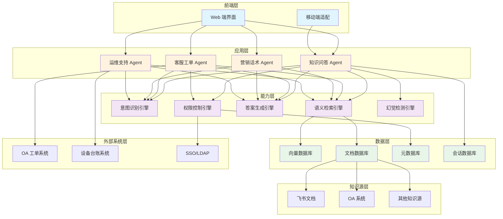
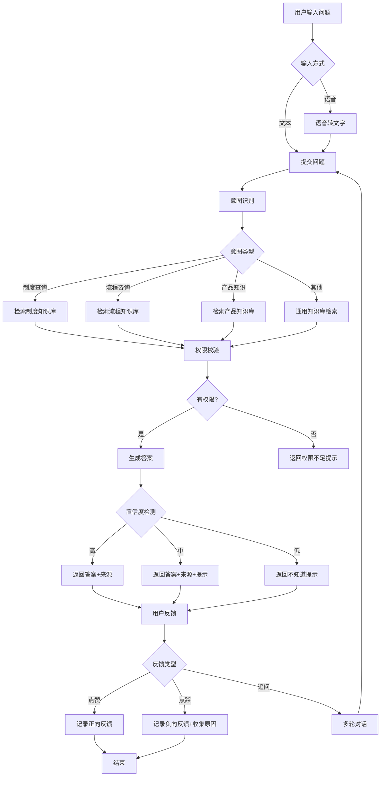
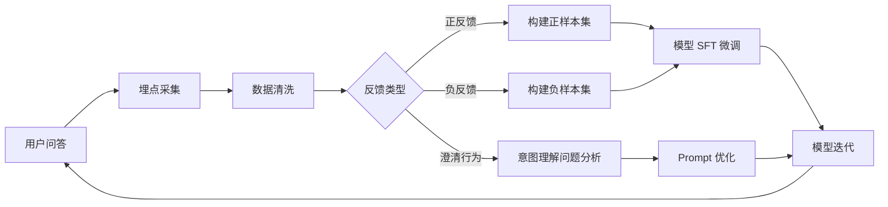
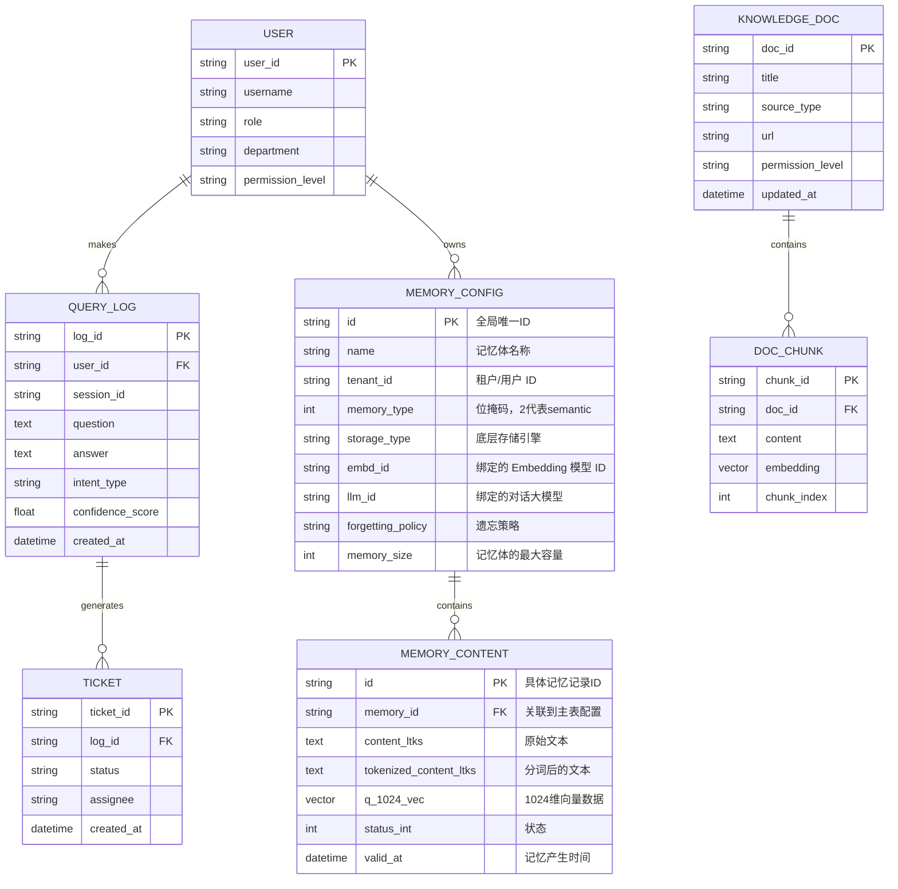

# 企业级知识库问答系统 PRD

***

## 1. 背景与目标

### 1.1 用户及背景

| 用户角色    | 核心痛点                     | 使用场景                 |
| ------- | ------------------------ | -------------------- |
| 内部员工    | 知识分散在多个系统，检索效率低，重复咨询同类问题 | 日常工作中需要查询制度、流程、产品知识等 |
| 客服团队    | 需要频繁切换系统查询信息并手动创建工单，响应慢  | 客户咨询时快速获取答案并自动创建工单   |
| 销售营销人员  | 缺乏针对性的营销话术和方案建议，影响转化率    | 客户沟通时需要快速生成专业话术和方案   |
| 新入职员工   | 培训资料分散，学习周期长，上手慢         | 培训期间快速获取标准答案和操作指引    |
| 运维工程师   | 设备台账信息与知识库分离，故障排查效率低     | 新能源电站设备故障时需要快速定位问题   |
| 外部客户/业主 | 无法自助获取项目信息，依赖客服响应        | 查询项目进度、设备状态等信息       |

### 1.2 市场现状

当前企业知识管理市场呈现以下特征：

1. **知识孤岛严重**：企业知识资产分散在文档系统、OA、邮件等多个平台，员工需要跨系统检索，效率低下
2. **传统搜索体验差**：基于关键词匹配的传统搜索引擎无法理解用户真实意图，召回率和准确率不足 40%
3. **知识更新滞后**：静态知识库无法及时同步最新信息，导致员工获取过时或错误答案
4. **多模态内容处理能力弱**：大部分系统无法有效处理图片、扫描件、视频等非结构化内容
5. **场景化需求凸显**：不同业务场景对知识问答有差异化需求，传统系统缺乏针对性设计

### 1.3 竞品分析

| 竞品名称       | 核心优势          | 主要劣势               | 差异化定位             |
| ---------- | ------------- | ------------------ | ----------------- |
| 钉钉 AI 助手   | 与办公深度集成，使用便捷  | 知识库能力有限，无法处理复杂业务场景 | 定位于通用办公助手，非专业问答系统 |
| 飞书智能伙伴     | 文档原生支持，知识更新及时 | 缺乏多场景适配，工单集成等能力缺失  | 聚焦协作文档场景          |
| 百度知识中台     | 搜索技术成熟，检索能力强  | 部署成本高，定制化能力弱       | 定位于大型企业的通用知识平台    |
| 微软 Copilot | 技术先进，多模态能力强   | 价格昂贵，国内部署受限        | 国际化企业办公场景         |
| 自研传统知识库    | 高度定制，数据安全     | 智能化程度低，维护成本高       | 早期企业知识管理系统        |

### 1.4 战略分析

**SWOT 分析**：

- **优势 (Strengths)**：统一平台整合多源知识、AI 原生设计、多场景适配、私有化部署能力
- **劣势 (Weaknesses)**：初期知识迁移成本高、用户习惯培养需时间、大模型调用成本较高
- **机会 (Opportunities)**：企业数字化转型加速、AI 技术成熟度提升、降本增效需求强烈
- **威胁 (Threats)**：巨头产品降维打击、开源方案竞争、数据安全合规风险

**竞争策略**：采用"场景深耕 + 私有化部署"差异化策略，聚焦企业内部知识管理垂直场景，提供开箱即用的五大场景解决方案，同时支持私有化部署满足数据安全需求。

### 1.5 可量化的目标

| 指标类别   | 指标名称   | 目标值     | 衡量方式                    |
| ------ | ------ | ------- | ----------------------- |
| 核心业务指标 | 问题解决率  | > 80%   | 用户问题得到有效回答的比例           |
| 核心业务指标 | 响应准确率  | > 90%   | 回答内容正确且相关的比例            |
| 用户体验指标 | 平均响应时长 | 3-10 秒  | 从提交问题到返回答案的时间           |
| 用户体验指标 | 用户满意度  | > 85%   | 用户点赞率及满意度调查             |
| 运营指标   | 知识覆盖率  | > 95%   | 核心业务领域知识文档覆盖度           |
| 成本指标   | 单次问答成本 | < 0.5 元 | 平均每次问答的 Token 成本 + 运维成本 |

### 1.6 成本与性能边界

| 维度         | 边界要求                              | 说明                   |
| ---------- | --------------------------------- | -------------------- |
| 单次调用成本上限   | ≤ 0.5 元/次                         | 包含大模型调用、向量检索、OCR 等成本 |
| Token 消耗监控 | 输入 < 4000 tokens，输出 < 2000 tokens | 单次对话的 Token 上限       |
| 响应延迟要求     | P95 < 10 秒，P50 < 3 秒              | 用户体验可接受的最大延迟         |
| 并发处理能力     | 支持 100 人同时在线，设计峰值 QPS=20          | 峰值并发场景（含 4 倍系统冗余）    |
| 知识库规模      | ≥ 1TB 文档容量                        | 支持飞书 + OA 全量知识资产     |

***

## 2. 产品定位

### 2.1 产品定义

企业级知识库问答系统是一个基于 RAG (检索增强生成) 技术的智能问答平台，通过统一接入企业多源知识资产（飞书文档、OA 系统等），利用大模型能力为不同业务场景（员工日常、客服、销售营销、培训、运维）提供精准、可溯源、可信任的问答服务。

### 2.2 核心价值主张

1. **知识统一聚合**：打破信息孤岛，实现飞书、OA 等多系统知识的统一检索
2. **场景化智能问答**：针对 5 大业务场景提供差异化能力，如客服场景支持工单创建、销售场景生成营销话术
3. **答案可溯源**：每个答案标注来源文档和段落，确保答案可信可查
4. **幻觉可控**：通过置信度标注和"不知道"机制，降低大模型幻觉风险
5. **权限精细管控**：支持 L1/L2/L3 数据分级 + RBAC+ABAC 混合权限模型，保障数据安全

### 2.3 AI 赋能较传统优势

| 传统方案                 | AI 赋能方案                  | 提升价值        |
| -------------------- | ------------------------ | ----------- |
| 关键词匹配搜索，召回率 < 40%    | 语义理解 + 向量检索，召回率 > 85%    | 检索准确率提升 1 倍 |
| 多系统人工切换，平均检索时间 15 分钟 | 统一问答入口，平均响应 3-10 秒       | 检索效率提升 90 倍 |
| 静态文档无法及时更新           | 定时同步 + 手动触发，知识实时更新       | 知识时效性提升     |
| 无多模态处理能力             | 支持 OCR、视频解析，覆盖图片/扫描件/音视频 | 知识覆盖率提升 30% |
| 人工客服重复回答             | AI 自动应答 + 人工介入机制         | 客服效率提升 50%  |

### 2.4 产品边界

**能做什么**：

- 支持多源知识统一检索（飞书文档、OA 系统）
- 支持 Word/PDF/Excel/PPT/图片/扫描件/音视频等多模态内容解析
- 支持 5 大业务场景的差异化能力（工单创建、营销话术生成等）
- 支持答案溯源和置信度标注
- 支持语音输入、文本对话、语音播报（可选）
- 支持私有化部署和数据分级管理

**不能做什么**：

- 不替代专业知识数据库（如 ERP、CRM 核心业务系统）
- 不处理实时交易类业务（如财务结算、订单处理）
- 不提供复杂的流程审批功能（仅提供信息查询和工单创建）
- 不支持移动端原生 App（仅 Web 端移动适配）
- 不提供深度定制开发（仅支持配置化调整）

***

## 3. 用户故事

### 3.1 员工日常问答场景

#### 故事描述

作为【内部员工】，我需要【通过自然语言提问快速获取公司制度、流程、产品等信息】，以便【提高工作效率，减少重复咨询】。

#### 正向场景 EARS

```gherkin
GIVEN 用户已登录系统
  AND 用户角色为"内部员工"
  AND 用户具有访问 L2 级别知识的权限
WHEN 用户输入问题"公司的年假制度是怎样的？"
  AND 系统识别到问题意图为"制度查询"
  AND 系统在知识库中检索到相关文档
THEN 系统在 5 秒内返回答案
  AND 答案包含年假天数、申请流程等关键信息
  AND 答案标注来源文档《员工手册 V2.0》和具体段落
  AND 答案置信度标注为"高"
```

#### 负向场景 EARS

```gherkin
GIVEN 用户已登录系统
  AND 用户角色为"内部员工"
  AND 用户仅有 L1 级别知识访问权限
WHEN 用户输入问题"查看公司最新的战略规划文档"
  AND 系统识别到问题涉及 L3 级别知识
THEN 系统返回"抱歉，您暂无权限查看此内容"
  AND 系统记录权限拦截日志
  AND 不返回任何 L3 级别知识内容
```

#### 用户旅程流程图



### 3.2 客服团队场景

#### 故事描述

作为【客服人员】，我需要【在回答客户问题时快速获取答案并一键创建工单】，以便【提升客户服务效率和满意度】。

#### 正向场景 EARS

```gherkin
GIVEN 客服人员已登录系统
  AND 正在处理客户来电咨询
WHEN 客服人员输入客户问题"新能源电站的设备故障如何排查？"
  AND 系统检索到相关运维知识
  AND 系统关联到设备台账信息
THEN 系统返回故障排查步骤
  AND 系统提示"是否需要创建工单"
  AND 客服确认后系统自动创建工单
  AND 工单包含问题描述、设备信息、建议方案
```

#### 负向场景 EARS

```gherkin
GIVEN 客服人员已登录系统
WHEN 客服人员输入问题，但 OA 系统接口异常
  AND 重试 3 次后仍无法连接
THEN 系统返回"工单创建失败，系统繁忙，请稍后重试或手动创建"
  AND 系统记录接口异常日志
  AND 提供手动创建工单的快捷链接
```

#### 用户旅程流程图



### 3.3 销售营销场景

#### 故事描述

作为【销售人员】，我需要【根据客户特征生成个性化的营销话术和方案建议】，以便【提升客户转化率】。

#### 正向场景 EARS

```gherkin
GIVEN 销售人员已登录系统
  AND 正在准备客户拜访
WHEN 销售人员输入"客户是新能源企业，关注运维成本降低，帮我生成营销话术"
  AND 系统检索到相关产品知识和成功案例
THEN 系统生成 3 条营销话术建议
  AND 每条话术包含价值点、案例支撑、话术示例
  AND 系统提供相关成功案例链接
```

#### 负向场景 EARS

```gherkin
GIVEN 销售人员已登录系统
WHEN 销售人员输入"帮我生成竞争对手的攻击话术"
  AND 系统识别到内容违反合规要求
THEN 系统返回"抱歉，无法生成涉及竞争对手攻击的内容，请调整需求"
  AND 系统记录合规拦截日志
```

#### 用户旅程流程图



### 3.4 新员工培训场景

#### 故事描述

作为【新入职员工】，我需要【快速获取标准化的培训答案和操作指引】，以便【缩短学习曲线，快速上手工作】。

#### 正向场景 EARS

```gherkin
GIVEN 新员工已登录系统
  AND 处于培训期
WHEN 新员工输入问题"如何使用 OA 系统提交报销申请？"
  AND 系统识别到用户为新员工
THEN 系统返回详细的操作步骤
  AND 系统关联到培训文档《OA 操作手册》
  AND 系统推荐相关学习资源
```

#### 负向场景 EARS

```gherkin
GIVEN 新员工已登录系统
WHEN 新员工输入问题过于模糊，如"系统怎么用"
THEN 系统返回"您的问题比较宽泛，请补充具体场景，如：OA 系统如何提交报销？"
  AND 系统提供常见问题快捷入口
```

### 3.5 新能源电站运维场景

#### 故事描述

作为【运维工程师】，我需要【在故障排查时快速获取解决方案并关联设备台账信息】，以便【提高故障处理效率】。

#### 正向场景 EARS

```gherkin
GIVEN 运维工程师已登录系统
  AND 正在处理电站设备故障
WHEN 运维工程师输入"XX 型号逆变器报故障代码 E001"
  AND 系统检索到故障处理知识
  AND 系统查询设备台账信息
THEN 系统返回故障原因分析
  AND 系统展示该设备的历史维护记录
  AND 系统提供处理步骤建议
```

#### 负向场景 EARS

```gherkin
GIVEN 运维工程师已登录系统
WHEN 运维工程师输入问题，但设备台账信息缺失
THEN 系统返回"未找到该设备台账信息，请联系管理员补充"
  AND 系统提供手动录入设备信息的入口
```

***

## 4. Agent 故事

### 4.1 知识问答 Agent

作为 **【知识问答 Agent (KnowledgeQA)】**
在 **【员工日常咨询、新员工培训等标准问答场景】** 下
为了 **【准确理解用户意图、检索知识库、生成可溯源答案】**，我需要以下支持：

#### 4.1.1 上下文信息

- 用户自然语言 Query
- 用户标识信息（user\_id、role、department、permission\_level）
- 历史对话上下文（最近 10 轮对话）
- 知识库索引配置（向量库地址、文档元数据）
- 权限规则配置（数据分级与角色权限映射表）

#### 4.1.2 能力支持

1. **意图识别能力**：识别用户意图类型（制度查询、流程咨询、产品知识、技术支持等）
2. **槽位抽取能力**：从问题中提取关键实体（时间、地点、产品型号、故障代码等）
3. **语义检索能力**：基于向量检索 + 关键词检索混合召回相关文档片段
4. **答案生成能力**：基于检索结果生成结构化答案，包含正文、来源、置信度
5. **权限判断能力**：校验用户是否有权访问检索到的知识内容
6. **幻觉检测能力**：评估答案置信度，低于阈值时返回"不知道"

#### 4.1.3 工具清单

**工具 1: vector\_search(query, top\_k, filter)**

- 用途：基于语义向量检索知识库
- 输入：查询文本、返回数量、权限过滤条件
- 输出：文档片段列表、相似度分数、来源元数据

**工具 2: keyword\_search(query, filter)**

- 用途：基于关键词检索知识库（兜底）
- 输入：查询文本、权限过滤条件
- 输出：文档片段列表、来源元数据

**工具 3: llm\_generate(context, query, output\_format)**

- 用途：基于检索上下文生成自然语言答案
- 输入：检索到的文档片段、用户问题、输出格式要求
- 输出：结构化答案（answer\_text + sources + confidence）

**工具 4: permission\_check(user\_id, doc\_level)**

- 用途：校验用户是否有权访问指定级别的文档
- 输入：用户 ID、文档分级标签
- 输出：布尔值（是否有权限）

#### 4.1.4 输出格式要求

```json
{
  "answer": "根据《员工手册 V2.0》，员工年假天数为：工作满1年不满10年的，年休假5天；工作满10年不满20年的，年休假10天；工作满20年的，年休假15天。",
  "sources": [
    {
      "doc_name": "员工手册 V2.0",
      "doc_id": "feishu_doc_12345",
      "paragraph": "第 3 章第 2 节第 5 条",
      "url": "https://feishu.cn/doc/xxx"
    }
  ],
  "confidence": "high",
  "confidence_score": 0.92,
  "related_questions": ["如何申请年假？", "年假可以累积吗？"]
}
```

#### 4.1.5 约束条件

- 必须基于检索到的真实文档生成答案，不得凭空编造
- 置信度 < 0.6 时，返回"抱歉，我无法确定答案，建议您咨询相关人员"
- 必须展示答案来源文档和具体段落，确保可溯源
- 严格遵守权限控制，不得返回用户无权访问的内容
- 输出必须符合 JSON Schema 结构化数据规范
- 单次检索返回的文档片段不超过 5 个，避免上下文过长

### 4.2 客服工单 Agent

作为 **【客服工单 Agent (ServiceTicketAgent)】**
在 **【客服团队处理客户咨询场景】** 下
为了 **【快速回答问题并自动创建工单】**，我需要以下支持：

#### 4.2.1 上下文信息

- 客服人员标识（agent\_id、skill\_level）
- 客户信息（customer\_id、project\_id、设备列表）
- 当前会话上下文（客户问题描述、已尝试的解决方案）
- OA 系统接口配置（工单创建 API、附件上传 API）
- 设备台账数据库连接配置

#### 4.2.2 能力支持

1. **问题分类能力**：识别问题类型（咨询、投诉、故障、建议）
2. **实体抽取能力**：提取设备型号、故障代码、项目编号等关键信息
3. **知识检索能力**：检索相关的故障处理方案、产品知识
4. **设备关联能力**：查询设备台账信息，关联历史维护记录
5. **工单生成能力**：基于问题信息生成结构化工单数据
6. **API 调用能力**：调用 OA 系统创建工单、上传附件

#### 4.2.3 工具清单

**工具 1: search\_knowledge(query, context)**

- 用途：检索故障处理知识库
- 输入：问题描述、上下文信息
- 输出：处理步骤、相关文档

**工具 2: get\_device\_info(device\_id)**

- 用途：查询设备台账信息
- 输入：设备 ID 或设备型号
- 输出：设备基本信息、历史维护记录、关联项目

**工具 3: create\_ticket(ticket\_data)**

- 用途：调用 OA 系统创建工单
- 输入：工单数据（问题描述、设备信息、优先级、客户信息）
- 输出：工单号、创建时间、负责人

**工具 4: upload\_attachment(file\_stream, file\_name)**

- 用途：上传对话记录或截图作为工单附件
- 输入：文件流、文件名
- 输出：附件 URL

#### 4.2.4 输出格式要求

```json
{
  "answer": "根据知识库，故障代码 E001 表示逆变器通信异常，建议按以下步骤排查：1. 检查通信线缆连接；2. 重启逆变器；3. 检查监控模块状态。",
  "device_info": {
    "device_id": "INV-2024-0123",
    "model": "SUN2000-100KTL",
    "install_date": "2024-03-15",
    "last_maintenance": "2024-11-01"
  },
  "ticket": {
    "ticket_id": "WO20250120001",
    "status": "created",
    "assignee": "运维组-张工",
    "priority": "高"
  },
  "sources": [...]
}
```

#### 4.2.5 约束条件

- 工单创建前必须向客服人员确认
- OA 系统调用失败时，提供手动创建工单的快捷入口
- 设备信息查询超时（>5 秒）时，跳过设备关联，仅返回答案
- 敏感信息（客户联系方式等）需脱敏后展示
- 工单优先级根据问题类型和客户级别自动判断

### 4.3 营销话术生成 Agent

作为 **【营销话术生成 Agent (SalesContentAgent)】**
在 **【销售营销人员准备客户沟通场景】** 下
为了 **【生成个性化的营销话术和方案建议】**，我需要以下支持：

#### 4.3.1 上下文信息

- 销售人员标识（sales\_id、负责产品线）
- 客户特征（行业、规模、痛点、关注点）
- 产品知识库（产品功能、优势、定价）
- 成功案例库（案例背景、解决方案、效果数据）

#### 4.3.2 能力支持

1. **需求理解能力**：解析客户特征和痛点
2. **产品匹配能力**：匹配适合客户的产品和解决方案
3. **案例检索能力**：检索相似客户案例
4. **话术生成能力**：生成针对性的营销话术
5. **合规审查能力**：检测话术中的合规风险（如夸大宣传、攻击竞争对手）

#### 4.3.3 工具清单

**工具 1: search\_products(query, industry)**

- 用途：检索适合客户的产品知识
- 输入：客户需求关键词、客户行业
- 输出：产品功能列表、优势对比

**工具 2: search\_cases(industry, scenario)**

- 用途：检索成功案例
- 输入：客户行业、应用场景
- 输出：案例列表、关键效果数据

**工具 3: generate\_pitch(product\_info, case\_info, customer\_profile)**

- 用途：生成营销话术
- 输入：产品信息、案例信息、客户画像
- 输出：多条营销话术建议

**工具 4: compliance\_check(content)**

- 用途：合规性审查
- 输入：生成的话术内容
- 输出：合规性评估结果、风险提示

#### 4.3.4 输出格式要求

```json
{
  "pitches": [
    {
      "id": 1,
      "theme": "降本增效",
      "content": "针对您关注的运维成本问题，我们的智能运维方案已帮助 XX 新能源电站降低 30% 运维成本...",
      "key_points": ["降低 30% 运维成本", "故障响应时间缩短 50%", "投资回报周期 < 2 年"],
      "supporting_case": {
        "case_name": "XX 新能源电站智能运维项目",
        "case_url": "https://..."
      }
    }
  ],
  "compliance_score": 0.95,
  "warnings": []
}
```

#### 4.3.5 约束条件

- 不得生成虚假案例或夸大产品效果
- 不得攻击竞争对手或泄露其商业机密
- 必须基于真实的产品知识和案例库生成话术
- 合规性评分 < 0.8 时，提示用户修改需求
- 输出话术数量不超过 5 条，避免信息过载

### 4.4 运维支持 Agent

作为 **【运维支持 Agent (OpsSupportAgent)】**
在 **【新能源电站运维人员现场排障与设备巡检场景】** 下
为了 **【快速定位故障原因、获取维修 SOP 并关联设备历史状态】**，我需要以下支持：

#### 4.4.1 上下文信息

- 运维人员标识（user\_id、role、所属电站）
- 设备唯一标识（device\_id 或 SN 码）
- 当前故障现象（文本描述、错误码或现场照片）
- 设备台账与历史维修记录数据库（外部接口）
- 运维知识库（包含设备手册、故障代码表、标准排障流程 SOP）

#### 4.4.2 能力支持

1. **多模态故障理解能力**：能够解析用户上传的故障面板截图，提取关键错误码。
2. **设备信息关联能力**：根据设备标识，调用台账接口查询该设备的过保状态、上次维修时间。
3. **故障树诊断能力**：根据故障现象与设备型号，在运维知识库中匹配对应的排障步骤。
4. **安全约束评估**：对于涉及高压电或危险操作的步骤，必须生成高亮安全警告。

#### 4.4.3 工具清单

**工具 1: query\_device\_ledger(device\_id)**

- 用途：查询设备台账与历史工单
- 输入：设备唯一标识码
- 输出：设备型号、出厂日期、近期维修工单记录

**工具 2: search\_ops\_knowledge(device\_model, error\_code, symptom)**

- 用途：检索对应设备型号和故障码的排障指南
- 输入：设备型号、错误码、故障现象描述
- 输出：标准排障流程 (SOP) 与手册出处

**工具 3: parse\_fault\_image(image\_url)**

- 用途：解析用户上传的现场报错图片（可选）
- 输入：图片 URL
- 输出：提取出的故障代码文本

#### 4.4.4 输出格式要求

```json
{
  "answer": "经诊断，逆变器(SN:1023)报 E001 故障表示直流侧过压。请注意：**该操作涉及高压危险，请务必佩戴绝缘手套！** \n\n排查步骤如下：\n1. 断开直流侧开关；\n2. 使用万用表测量组串开路电压；\n3. 若电压超过 1100V，请检查组串串联数量是否超标。",
  "device_status": {
    "device_id": "SN1023",
    "model": "SUN2000-100KTL",
    "warranty_status": "在保",
    "last_maintenance": "2024-05-12"
  },
  "safety_warning": true,
  "sources": [
    {
      "doc_name": "SUN2000 运维手册 V3",
      "paragraph": "第 5 章：故障排查",
      "url": "https://..."
    }
  ]
}
```

#### 4.4.5 约束条件

- 当未提供设备 ID 且无法从图片中提取时，必须追问用户提供具体的设备型号。
- 若检索到的排障步骤涉及“更换核心部件”等高权限操作，必须在答案末尾提示用户“此操作需上报站长审批”。
- 台账系统查询超时 (>5秒) 时，降级为仅返回故障排查步骤，并提示“设备台账获取失败，当前仅提供通用排障建议”。

***

## 5. 用户旅程

### 5.1 整体用户旅程



***

## 6. Agent 工作流程

### 6.1 知识问答 Agent 工作流程

#### 6.1.1 基本信息

| 项目       | 说明                          |
| -------- | --------------------------- |
| Agent 名称 | KnowledgeQA                 |
| 角色定位     | 企业知识库问答的核心 Agent，负责处理标准问答场景 |
| 核心能力聚焦   | 意图识别、语义检索、答案生成、权限校验、幻觉控制    |

#### 6.1.2 核心职责

| 核心职责 | 说明                           |
| ---- | ---------------------------- |
| 意图识别 | 判断用户问题的类型（制度查询、流程咨询、产品知识等）   |
| 槽位抽取 | 提取问题中的关键实体（时间、地点、产品型号等）      |
| 权限校验 | 基于用户角色和数据分级规则，判断用户是否有权访问相关内容 |
| 知识检索 | 通过向量检索 + 关键词检索混合召回相关文档片段     |
| 答案生成 | 基于检索结果生成自然语言答案，包含正文、来源、置信度   |
| 幻觉检测 | 评估答案置信度，低于阈值时返回"不知道"         |
| 多轮对话 | 维护对话上下文，支持追问和意图澄清            |

#### 6.1.3 输入

- 用户自然语言 Query
- 用户标识信息（user\_id、role、department、permission\_level）
- 会话 ID（session\_id）
- 历史对话上下文（最近 10 轮对话）
- 权限规则配置（数据分级与角色权限映射表）

#### 6.1.4 多轮对话与上下文管理规范

在标准问答场景下，Agent 需要在受限的 Token 预算内精准维护历史上下文，具体管理策略如下：

- **Token 预算分配**：假设使用 GPT-4-Turbo（输入上限 4000 token），系统 Prompt 占 500，当前问题占 500，检索返回的 Top-5 文档片段占 2200，留给**历史对话的 Token 预算为 800**。
- **窗口管理与压缩策略**：
  - 默认携带最近 3 轮对话记录（Q\&A 形式）。
  - 若最近 3 轮历史对话的长度超过 800 Token，触发**摘要压缩机制**，使用 LLM 提炼历史对话的核心意图与结论，替换掉原始的长文本记录。
  - **会话超时机制**：用户无操作超过 30 分钟，自动将当前 `session_id` 标记为结束。下次提问时重新创建会话，不携带历史上下文。
- **指代消解 (Coreference Resolution)**：在执行"意图识别"前，必须将当前问题结合历史对话进行重写。例如，当历史对话在讨论"员工手册"，用户追问"那第二章讲了什么"时，必须重写为"员工手册第二章讲了什么"，再用重写后的问题去检索知识库。

#### 6.1.5 输出

| 字段                 | 示例值                           | 说明                     |
| ------------------ | ----------------------------- | ---------------------- |
| answer             | "根据《员工手册 V2.0》..."            | 生成的答案文本                |
| sources            | \[{"doc\_name": "员工手册", ...}] | 答案来源文档列表               |
| confidence         | "high"                        | 置信度等级（high/medium/low） |
| confidence\_score  | 0.92                          | 置信度分数（0-1）             |
| related\_questions | \["如何申请年假？", ...]             | 相关问题推荐                 |
| answer\_type       | "text"                        | 答案类型（text/table/chart） |

#### 6.1.6 流程说明

> 参考自 RAG 标准工作流程：
>
> 1. **文档处理**：上传 -> 解析（支持多模态及OCR）-> 切块/分词/向量化 -> 入库增强（生成关键词/摘要/TOC等）。
> 2. **检索与生成**：用户提问 -> 查询理解/改写（多轮补全、意图识别）-> 基础检索（全文+向量+Rerank）-> 构造回答上下文 -> 最终答案生成。

具体到本 Agent 的实时问答流程如下：

1. **接收请求**：前端提交用户问题 + 用户信息 + 会话上下文
2. **意图识别与查询改写**：使用大模型判断用户意图类型（制度查询、流程咨询等），并进行多轮对话指代消解补全成完整问题，补充检索关键词，自动生成 metadata filter。
3. **槽位抽取**：提取问题中的关键实体，补充检索条件
4. **权限校验**：基于用户角色和数据分级规则，构建检索过滤条件
5. **知识检索**：调用向量检索 + 关键词检索进行全文检索与向量检索，并进行融合排序，可选 Rerank，召回 Top-K 相关文档片段
6. **构造回答上下文**：组织 retrieved chunks，注入 citation prompt，拼接 knowledge prompt。
7. **答案生成**：根据系统提示词 + 检索结果 + 用户问题生成回答。
8. **幻觉检测**：评估答案置信度，低于阈值时返回"不知道"
9. **返回结果**：可流式输出结构化答案 + 来源 + 置信度

#### 6.1.7 时序泳道图

```mermaid
sequenceDiagram
    autonumber
    participant User as 👤 用户
    participant Agent as 🤖 Agent 核心控制器
    participant Tools as 🛠️ 工具层
    participant Knowledge as 📚 知识库系统

    Note over User, Knowledge: 1️⃣ 需求理解阶段
    User->>Agent: 提交问题 + 用户信息
    
    Agent->>Agent: 🔍 意图识别
    Agent->>Agent: 📦 槽位抽取
    Agent->>Agent: 🛡️ 权限校验
    
    Note over User, Knowledge: 2️⃣ 知识检索阶段
    Agent->>Tools: 🚀 调用检索工具
    
    Tools->>Knowledge: 向量检索
    Knowledge-->>Tools: 返回文档片段
    Tools->>Knowledge: 关键词检索（兜底）
    Knowledge-->>Tools: 返回文档片段
    Tools-->>Agent: 合并检索结果
    deactivate Tools
    
    Note over User, Knowledge: 3️⃣ 答案生成阶段
    Agent->>Agent: 🧠 生成答案
    Agent->>Agent: ⚖️ 幻觉检测
    
    alt 置信度过低
        Agent->>User: 返回"不知道"提示
    else 置信度正常
        Agent->>Agent: ✨ 格式化输出
        Agent-->>User: 返回答案 + 来源
    end
    
    deactivate Agent
    
    Note over User, Knowledge: 4️⃣ 反馈学习阶段（异步）
    Agent->>Agent: 📝 记录对话日志
    Agent->>Agent: 📊 监控指标
```

### 6.2 客服工单 Agent 工作流程

#### 6.2.1 基本信息

| 项目       | 说明                       |
| -------- | ------------------------ |
| Agent 名称 | ServiceTicketAgent       |
| 角色定位     | 客服场景专用 Agent，负责问答 + 工单创建 |
| 核心能力聚焦   | 问题分类、设备关联、工单生成、OA 系统集成   |

#### 6.2.2 核心职责

| 核心职责   | 说明                    |
| ------ | --------------------- |
| 问题分类   | 判断问题类型（咨询、投诉、故障、建议）   |
| 实体抽取   | 提取设备型号、故障代码、项目编号等关键信息 |
| 知识检索   | 检索故障处理方案、产品知识         |
| 设备关联   | 查询设备台账信息，关联历史维护记录     |
| 工单生成   | 基于问题信息生成结构化工单数据       |
| API 调用 | 调用 OA 系统创建工单、上传附件     |

#### 6.2.3 输入

- 客服人员标识（agent\_id、skill\_level）
- 客户信息（customer\_id、project\_id）
- 问题描述（文本 + 可选图片）
- 设备信息（设备 ID 或设备型号，可选）
- 会话上下文（已尝试的解决方案）

#### 6.2.4 输出

| 字段           | 示例值                                  | 说明       |
| ------------ | ------------------------------------ | -------- |
| answer       | "故障代码 E001 表示..."                    | 生成的答案文本  |
| device\_info | {"device\_id": "INV-2024-0123", ...} | 设备台账信息   |
| ticket       | {"ticket\_id": "WO20250120001", ...} | 工单创建结果   |
| sources      | \[...]                               | 答案来源文档列表 |

#### 6.2.5 流程说明

1. **接收请求**：客服提交问题 + 客户信息 + 设备信息（可选）
2. **问题分类**：判断问题类型，确定处理策略
3. **实体抽取**：提取设备型号、故障代码等关键信息
4. **设备关联**：查询设备台账信息，关联历史维护记录
5. **知识检索**：检索故障处理方案
6. **答案生成**：生成答案 + 设备信息
7. **工单生成**：基于问题信息生成工单数据
8. **用户确认**：向客服确认是否创建工单
9. **API 调用**：调用 OA 系统创建工单
10. **返回结果**：返回答案 + 设备信息 + 工单结果

#### 6.2.6 时序泳道图



### 6.3 运维支持 Agent 工作流程

#### 6.3.1 基本信息

| 项目       | 说明                         |
| -------- | -------------------------- |
| Agent 名称 | OpsSupportAgent            |
| 角色定位     | 运维场景专用 Agent，负责故障排查与设备状态诊断 |
| 核心能力聚焦   | 故障树诊断、设备台账查询、维修记录关联、排障步骤生成 |

#### 6.3.2 核心职责

| 核心职责   | 说明                    |
| ------ | --------------------- |
| 故障信息提取 | 提取故障现象、错误代码、设备型号、发生时间 |
| 设备台账查询 | 基于设备标识获取历史维修记录、保养周期   |
| 故障树诊断  | 基于知识库匹配标准排障流程 (SOP)   |
| 诊断结论生成 | 综合设备状态与知识库输出排查步骤与建议   |

#### 6.3.3 输入

- 运维人员标识（user\_id, role）
- 设备唯一标识（device\_id 或 SN 码，选填）
- 故障现象描述（文本/图片/错误码）

#### 6.3.4 输出

| 字段           | 示例值                                             | 说明          |
| ------------ | ----------------------------------------------- | ----------- |
| answer       | "错误代码 E001 表示逆变器过载..."                          | 故障原因及排查步骤文本 |
| device\_info | {"device\_id": "INV-2024", "status": "offline"} | 关联的设备状态信息   |
| next\_steps  | \["重启逆变器", "检查交流侧电压"]                           | 推荐操作建议数组    |
| sources      | \[...]                                          | 故障手册来源链接    |

#### 6.3.5 流程说明

1. **接收请求**：接收运维人员提交的故障现象与设备信息。
2. **信息补全**：若只有现象无设备信息，系统提示补充；若有设备信息，调用台账接口获取设备档案。
3. **故障诊断检索**：根据故障现象+设备型号，在运维知识库（SOP、手册）中检索解决方案。
4. **答案生成**：融合设备历史状态和知识库内容，生成逐步排查建议。
5. **返回结果**：返回结构化排障指南和设备档案。

#### 6.3.6 时序泳道图



***

## 7. 产品功能清单

### 7.1 系统架构



### 7.2 功能总表

| 编号 | 模块   | 功能名称       | 功能描述                        | 功能类型 | 价值 | 优先级 |
| -- | ---- | ---------- | --------------------------- | ---- | -- | --- |
| 1  | 用户管理 | 用户登录       | 支持 SSO/LDAP 统一认证登录          | Web  | 高  | P1  |
| 2  | 用户管理 | 权限管理       | 基于角色和属性的混合权限控制              | Web  | 高  | P1  |
| 3  | 用户管理 | 数据分级       | L1/L2/L3 三级数据分级管理           | Web  | 高  | P1  |
| 4  | 知识管理 | 知识导入       | 支持飞书、OA 等多源知识导入             | Web  | 高  | P1  |
| 5  | 知识管理 | 知识解析       | 支持 Word/PDF/Excel/PPT 等格式解析 | 后端   | 高  | P1  |
| 6  | 知识管理 | OCR 解析     | 支持图片、扫描件文字识别                | 后端   | 高  | P1  |
| 7  | 知识管理 | 视频解析       | 支持视频内容提取和索引                 | 后端   | 中  | P2  |
| 8  | 知识管理 | 知识同步       | 定时同步 + 手动触发同步               | 后端   | 高  | P1  |
| 9  | 知识管理 | 知识更新       | 增量更新知识库索引                   | 后端   | 高  | P1  |
| 10 | 知识管理 | 知识分级标签     | 为知识文档打上 L1/L2/L3 标签         | Web  | 高  | P1  |
| 11 | 问答功能 | 文本对话       | 支持文本输入和对话                   | Web  | 高  | P1  |
| 12 | 问答功能 | 语音输入       | 支持语音转文字输入                   | Web  | 中  | P2  |
| 13 | 问答功能 | 语音播报       | 支持答案语音播报（可选）                | Web  | 低  | P3  |
| 14 | 问答功能 | 单轮问答       | 支持单轮问题直接回答                  | Web  | 高  | P1  |
| 15 | 问答功能 | 多轮对话       | 支持追问、意图澄清等多轮交互              | Web  | 高  | P1  |
| 16 | 问答功能 | 答案溯源       | 展示答案来源文档和段落                 | Web  | 高  | P1  |
| 17 | 问答功能 | 置信度标注      | 标注答案置信度（高/中/低）              | Web  | 高  | P1  |
| 18 | 问答功能 | 幻觉控制       | 不确定时返回"不知道"                 | Web  | 高  | P1  |
| 19 | 问答功能 | 相关问题推荐     | 推荐相关问题帮助用户深入查询              | Web  | 中  | P2  |
| 20 | 问答功能 | 答案格式       | 支持文字 + 图表 + 来源链接            | Web  | 高  | P1  |
| 21 | 场景功能 | 客服工单创建     | 对话中一键创建 OA 工单               | Web  | 高  | P1  |
| 22 | 场景功能 | 设备台账关联     | 查询设备信息并关联知识                 | Web  | 高  | P1  |
| 23 | 场景功能 | 营销话术生成     | 根据客户特征生成营销话术                | Web  | 高  | P1  |
| 24 | 场景功能 | 方案建议生成     | 生成针对性的解决方案建议                | Web  | 中  | P2  |
| 25 | 反馈功能 | 点赞点踩       | 用户对答案进行评价                   | Web  | 高  | P1  |
| 26 | 反馈功能 | 问题反馈       | 用户提交问题反馈                    | Web  | 中  | P2  |
| 27 | 反馈功能 | 对话行为分析     | 分析用户二次澄清、修改意图等行为            | 后端   | 中  | P2  |
| 28 | 管理后台 | 知识库管理      | 管理知识库文档、分类、标签               | Web  | 高  | P1  |
| 29 | 管理后台 | 权限配置       | 配置角色权限和数据分级规则               | Web  | 高  | P1  |
| 30 | 管理后台 | 问答日志       | 查看问答日志和统计                   | Web  | 高  | P1  |
| 31 | 管理后台 | 监控告警       | 系统运行监控和异常告警                 | Web  | 高  | P1  |
| 32 | 管理后台 | Token 消耗监控 | 监控大模型 Token 消耗和成本           | Web  | 高  | P1  |
| 33 | 管理后台 | 用户行为分析     | 分析用户问答行为和满意度                | Web  | 中  | P2  |
| 34 | 管理后台 | 知识覆盖率分析    | 分析知识库覆盖情况和缺口                | Web  | 中  | P2  |
| 35 | 系统集成 | OA 系统集成    | 工单流程记录 + 文档附件同步             | 后端   | 高  | P1  |
| 36 | 系统集成 | 飞书文档集成     | 飞书文档同步和权限映射                 | 后端   | 高  | P1  |
| 37 | 系统集成 | 设备台账集成     | 设备台账信息查询                    | 后端   | 高  | P1  |

### 7.3 系统组件

#### 7.3.1 模型网关（Model Gateway）

- **功能**：统一管理大模型调用，支持多模型路由、负载均衡、超时重试
- **组件**：模型路由器、Token 计数器、成本监控器、缓存层
- **支持的模型**：GPT-4、Claude、通义千问、文心一言等主流大模型

#### 7.3.2 记忆模块（Memory Module）

- **短期记忆**：会话级上下文管理，存储最近 10 轮对话
- **长期记忆**：用户偏好、历史查询记录（可选）
- **存储介质**：Redis（短期）+ MySQL（长期）

#### 7.3.3 知识处理引擎 (Knowledge Pipeline)

- **文档解析**：支持多模态内容抽取（PDF/Word/Excel，OCR解析图文，ASR解析音视频）
- **知识清洗**：基于 MD5 去重，去除乱码与无意义特殊符号，提取结构化元数据（标题、作者、权限标签、更新时间等）
- **分块策略 (Chunking)**：固定长度分块（512 token/chunk），重叠窗口（Overlap 128 token），按段落/换行符动态边界微调
- **向量化与存储**：文本转换为向量后，连同元数据（Metadata）一并写入 Milvus 和 MongoDB
- **增量更新机制**：通过比对文档哈希值，当发现变更时，先软删除旧 Chunk 索引，再解析并入库新 Chunk

#### 7.3.4 检索引擎与策略

- **向量检索**：基于 BGE-M3 模型，默认 Top-K=20
- **关键词检索**：基于 BM25 或 ES，默认 Top-K=10
- **混合检索策略**：基于 RRF (Reciprocal Rank Fusion) 算法融合向量和关键词检索结果
- **重排序 (Rerank)**：使用 BGE-Reranker-Large 模型对召回的 30 条结果重新打分，提取 Top-5 最终送入 LLM 上下文
- **权限过滤机制**：必须**前置过滤**，在检索底层基于 Milvus 的 Partition 隔离和 Metadata Filter 进行，避免检索出无权文档后引发的性能和合规问题

#### 7.3.5 权限控制引擎

- **RBAC 模型**：基于角色的访问控制（内部员工、外部客户、管理员等）
- **ABAC 模型**：基于属性的访问控制（部门、项目、数据分级等）
- **混合策略**：RBAC 定义角色，ABAC 定义属性条件，两者结合判断权限

#### 7.3.6 幻觉检测引擎

- **置信度评估**：基于检索相似度和生成概率评估答案置信度
- **事实核查**：关键信息与源文档比对，标注不一致项
- **兜底策略**：置信度 < 0.6 时返回"不知道"，引导用户咨询人工

***

## 8. 功能详细说明

### 8.1 问答核心模块

#### 8.1.1 原型与界面内容

```
┌─────────────────────────────────────────────────────────┐
│  🔍 企业知识库问答系统                    👤 张三 ▼  ⚙️  │
├─────────────────────────────────────────────────────────┤
│                                                           │
│  ┌─────────────────────────────────────────────────┐   │
│  │  📅 2025-01-20                                   │   │
│  │  👤 您：公司的年假制度是怎样的？                  │   │
│  │                                                   │   │
│  │  🤖 系统回答：                                    │   │
│  │  根据《员工手册 V2.0》，员工年假天数为：          │   │
│  │  • 工作满 1 年不满 10 年：年休假 5 天            │   │
│  │  • 工作满 10 年不满 20 年：年休假 10 天          │   │
│  │  • 工作满 20 年：年休假 15 天                    │   │
│  │                                                   │   │
│  │  📎 来源：《员工手册 V2.0》第 3 章第 2 节         │   │
│  │  🎯 置信度：高 (92%)                              │   │
│  │  👍 👎   💬 反馈                                  │   │
│  │                                                   │   │
│  │  相关问题：                                       │   │
│  │  • 如何申请年假？                                 │   │
│  │  • 年假可以累积吗？                               │   │
│  └─────────────────────────────────────────────────┘   │
│                                                           │
│  ┌─────────────────────────────────────────────────┐   │
│  │ 🎤  请输入问题...                          发送 ➤  │   │
│  └─────────────────────────────────────────────────┘   │
│                                                           │
└─────────────────────────────────────────────────────────┘
```

#### 8.1.2 交互元素清单

**对话展示区**

| 信息项   | 展示位置 | 说明                 |
| ----- | ---- | ------------------ |
| 用户问题  | 左侧气泡 | 显示用户输入的问题文本        |
| 系统回答  | 右侧气泡 | 显示 AI 生成的答案文本      |
| 答案来源  | 回答下方 | 显示来源文档名称和章节，支持点击跳转 |
| 置信度标签 | 回答下方 | 显示"高/中/低"三级置信度标签   |
| 反馈按钮  | 回答下方 | 点赞/点踩/反馈按钮         |
| 相关问题  | 回答下方 | 显示 3 个相关问题推荐       |

**输入区域**

| 元素名称   | 类型  | 是否必填 | 默认值 | 说明          | 联动规则          |
| ------ | --- | ---- | --- | ----------- | ------------- |
| 问题输入框  | 文本域 | 是    | 空   | 支持文本输入和语音输入 | 输入内容后"发送"按钮高亮 |
| 语音输入按钮 | 按钮  | 否    | -   | 点击开始录音      | 录音时按钮显示"停止"   |
| 发送按钮   | 按钮  | 是    | -   | 提交问题        | 输入框为空时按钮置灰    |

#### 8.1.3 业务功能逻辑交互框图



#### 8.1.4 异常兜底策略

| 异常场景           | 兜底策略             | 用户提示                                  |
| -------------- | ---------------- | ------------------------------------- |
| 模型超时（>30 秒）    | 降级为关键词检索 + 模板答案  | "抱歉，系统响应较慢，已为您简化答案。如需详细信息，请稍后重试。"     |
| 模型调用失败（重试 3 次） | 返回预设提示 + 人工客服入口  | "系统繁忙，建议您稍后重试或联系人工客服。"                |
| 置信度过低（< 0.6）   | 返回"不知道" + 推荐咨询渠道 | "抱歉，我无法确定答案，建议您咨询 HR 部门或查看《员工手册》完整版。" |
| 权限不足           | 拒绝访问 + 引导申请权限    | "抱歉，您暂无权限查看此内容。如需访问，请申请 L2 级别权限。"     |
| 内容合规审查失败       | 拦截回答 + 记录日志      | "抱歉，您的问题涉及敏感内容，无法回答。"                 |

#### 8.1.5 数据飞轮与反馈机制

**用户反馈埋点**

| 埋点事件                     | 触发条件      | 采集数据                                           | 用途          |
| ------------------------ | --------- | ---------------------------------------------- | ----------- |
| answer\_displayed        | 答案展示给用户   | question, answer, sources, confidence          | 统计答案展示量     |
| user\_like               | 用户点击点赞    | question, answer, sources                      | 标注正样本用于模型微调 |
| user\_dislike            | 用户点击点踩    | question, answer, sources, dislike\_reason     | 标注负样本用于模型优化 |
| user\_clarify            | 用户追问或修改意图 | original\_question, clarify\_question, context | 分析意图理解问题    |
| source\_click            | 用户点击来源链接  | question, answer, source\_url                  | 分析来源可信度     |
| related\_question\_click | 用户点击相关问题  | question, related\_question                    | 优化相关问题推荐    |

**数据流转路径**



#### 8.1.6 交互状态机与流式输出规范

为了提供流畅的对话体验，前端在问答主路径上必须遵循以下交互状态机和时间阈值：

| 状态阶段      | 持续时间     | 触发条件                     | 前端表现                                        |
| :-------- | :------- | :----------------------- | :------------------------------------------ |
| **就绪**    | -        | 用户停留在输入框                 | 输入框激活，可键入/语音                                |
| **请求中**   | 0\~1s    | 用户点击发送或回车                | 禁用输入框及发送按钮，展示微型 Loading 动画（防止二次点击）          |
| **意图与检索** | 1\~3s    | 等待大模型路由与底层检索             | 气泡上方展示："🔍 正在检索知识库..."                      |
| **流式生成**  | 3\~10s   | 接收到 SSE 首帧 (First Token) | 气泡上方状态切换为："🤖 AI 正在思考..."（附带光标闪烁的打字机效果逐字输出） |
| **长时等待**  | 10\~30s  | SSE 流迟迟未结束或首帧迟迟未到        | 气泡状态切换为："⏳ 系统处理中，请耐心等待"（防焦虑提示）              |
| **完成/兜底** | >30s 或完成 | 收到 `[DONE]` 标识或触发超时阈值    | 解锁输入框，展示点赞/点踩组件与来源参考；若超时则展示降级答案             |

- **SSE 断连与重连策略**：如果流式传输在未收到 `[DONE]` 标识前意外断开，前端尝试进行 1 次无感重连（携带当前的 chunk offset）；若重试仍失败，弹出全局 Toast "网络异常，当前回答已中断"。

***

## 9. 接口定义与集成规范

### 9.1 全局接口规范

- **接口协议**：RESTful API
- **流式输出**：对于大模型问答接口（如 `/api/v1/qa/ask`），采用 Server-Sent Events (SSE) 协议实现流式输出。
- **数据格式**：请求和非流式响应均使用 `application/json`。
- **鉴权方式**：基于 JWT (JSON Web Token) 的 Bearer Token 认证，放在 HTTP Header 的 `Authorization` 字段。

### 9.2 核心业务接口详细定义（前后端联调用）

#### 9.2.1 问答接口 (流式)

- **接口路径**：`POST /api/v1/qa/ask`
- **鉴权**：需要 Token 鉴权
- **请求体 (Request Schema)**：
  ```json
  {
    "question": "string (必填，最大 500 字符，用户问题)",
    "session_id": "string (选填，用于多轮对话上下文关联)",
    "input_type": "enum (必填，text|voice)",
    "scene": "enum (必填，general|service|sales|training|ops)"
  }
  ```
- **响应体 (SSE 消息帧格式)**：
  ```json
  // 数据帧 (event: message)
  {
    "id": "msg_123",
    "event": "message",
    "data": {
      "chunk": "string (增量生成的答案文本)",
      "status": "enum (generating|completed|error)"
    }
  }

  // 结束帧 (event: done)
  {
    "id": "msg_123",
    "event": "done",
    "data": {
      "full_answer": "string (完整答案)",
      "sources": [
        {
          "doc_name": "string",
          "chapter": "string",
          "url": "string"
        }
      ],
      "confidence": "enum (high|medium|low)"
    }
  }
  ```

#### 9.2.2 知识库文档同步接口

- **接口路径**：`POST /api/v1/knowledge/sync`
- **鉴权**：需要 Token 鉴权（管理员角色）
- **请求体 (Request Schema)**：
  ```json
  {
    "source_type": "enum (必填，feishu|oa|local)",
    "doc_ids": ["string (选填，指定同步的文档 ID 列表，为空则全量同步)"],
    "sync_mode": "enum (必填，full|incremental)"
  }
  ```
- **响应体 (Response Schema)**：
  ```json
  {
    "code": 20000,
    "message": "success",
    "data": {
      "task_id": "string (同步任务 ID，用于后续查询进度)"
    }
  }
  ```

### 9.3 核心业务接口详细定义（后端微服务/外部依赖用）

| 接口名称     | 提供方    | 调用方      | 主要用途       | 关键输入                              | 关键输出               | 业务约束                         |
| -------- | ------ | -------- | ---------- | --------------------------------- | ------------------ | ---------------------------- |
| 知识检索接口   | 知识库系统  | Agent    | 检索知识库文档    | query, top\_k, permission\_filter | doc\_list, scores  | 必须在检索底层完成权限过滤，单次检索耗时 < 300ms |
| 工单创建接口   | OA 系统  | 客服 Agent | 创建工单       | ticket\_data                      | ticket\_id, status | 必须异步调用，失败重试 3 次，需支持回调通知      |
| 飞书文档读取接口 | 飞书 API | 知识处理服务   | 获取文档正文及元数据 | doc\_id                           | content, metadata  | 需处理飞书 API 的限流（Rate Limit）    |

### 9.4 错误码体系

| 错误码段  | 模块分类   | 示例错误码 | 错误描述        | 前端处理策略           | 后端处理策略             |
| :---- | :----- | :---- | :---------- | :--------------- | :----------------- |
| 400xx | 请求参数错误 | 40001 | 请求参数格式不合法   | 提示用户检查输入         | 拦截请求，返回错误详情        |
| 401xx | 认证与授权  | 40101 | Token 失效或过期 | 强制退出，跳转登录页       | 拒绝访问               |
| 403xx | 权限控制   | 40301 | 无权访问该级别数据   | 提示"权限不足，请申请对应权限" | 拦截检索和生成，记录越权日志     |
| 500xx | 内部服务错误 | 50001 | 大模型服务调用超时   | 显示兜底答案或"系统繁忙"提示  | 触发重试机制，若重试失败则降级    |
| 500xx | 内部服务错误 | 50002 | 向量检索服务异常    | 提示"检索服务暂不可用"     | 降级为关键词检索，触发 P1 级告警 |

***

## 10. 界面交互与原型描述

### 10.1 页面清单

| 页面名称   | 页面路径              | 访问权限  | 主要功能    |
| ------ | ----------------- | ----- | ------- |
| 登录页    | /login            | 所有人   | 用户登录认证  |
| 问答主页   | /qa               | 已登录用户 | 问答对话主界面 |
| 知识库管理页 | /admin/knowledge  | 管理员   | 知识库文档管理 |
| 权限配置页  | /admin/permission | 管理员   | 权限规则配置  |
| 问答日志页  | /admin/logs       | 管理员   | 问答日志查询  |
| 监控看板页  | /admin/monitor    | 管理员   | 系统监控和告警 |
| 用户设置页  | /settings         | 已登录用户 | 个人设置和偏好 |

### 10.2 关键界面描述

#### 10.2.1 问答主页

**组件构成**：

- **顶部导航栏**：系统 Logo、用户信息、设置入口、退出登录
- **对话展示区**：历史对话列表、当前对话内容
- **输入区域**：问题输入框、语音输入按钮、发送按钮
- **侧边栏**：历史对话记录、收藏问题、快捷入口

**状态说明**：

- **空闲状态**：显示欢迎语和使用指引
- **输入中**：输入框高亮，发送按钮可点击
- **检索中**：显示"AI 正在思考..."动画，预计等待时间
- **生成中**：流式输出答案内容，实时显示
- **完成状态**：显示完整答案、来源、置信度、反馈按钮
- **错误状态**：显示错误提示和重试按钮

#### 10.2.2 知识库管理页

**组件构成**：

- **筛选区**：知识来源、文档类型、数据分级、同步状态筛选
- **文档列表**：文档名称、来源、上传时间、同步状态、操作按钮
- **操作按钮**：上传文档、同步知识、删除文档、查看详情
- **详情面板**：文档内容预览、元数据、关联问答记录

**状态说明**：

- **列表加载中**：显示骨架屏
- **同步中**：显示同步进度条
- **同步成功**：显示成功标识
- **同步失败**：显示失败原因和重试按钮

### 10.3 AI 透明度与预期管理

#### 10.3.1 免责声明

在问答界面底部显著位置展示：

> ⚠️ **声明**：本系统基于企业知识库提供智能问答服务，答案仅供参考。系统可能因知识库更新不及时或理解偏差导致答案不准确，重要决策请以官方文档或人工咨询为准。

#### 10.3.2 状态提示

| 状态   | 提示文案                  | 展示位置   |
| ---- | --------------------- | ------ |
| 检索中  | "🔍 正在检索知识库..."       | 对话气泡上方 |
| 生成中  | "🤖 AI 正在思考..."       | 对话气泡上方 |
| 置信度中 | "答案置信度：中等，建议参考原始文档确认" | 答案下方   |
| 置信度低 | "⚠️ 答案置信度较低，可能存在误差"   | 答案下方   |

#### 10.3.3 来源展示

每个答案必须展示：

- **来源文档名称**：可点击跳转到原文
- **文档章节**：具体段落位置
- **数据分级标签**：L1/L2/L3 标识
- **更新时间**：文档最后更新时间

示例：

> 📎 来源：《员工手册 V2.0》第 3 章第 2 节 | L2 级知识 | 更新于 2025-01-15

***

## 11. 模型选型及 Prompt 设计

### 11.1 模型清单

| 任务名称     | 模型选型推荐          | 业务场景      | 触发条件          | 输入                 | 输出         | 异常处理              |
| -------- | --------------- | --------- | ------------- | ------------------ | ---------- | ----------------- |
| 意图识别     | 通义千问-Plus       | 所有问答场景    | 用户提交问题        | 问题文本 + 上下文         | 意图类型 + 置信度 | 置信度 < 0.7 时返回"其他" |
| 槽位抽取     | 通义千问-Plus       | 所有问答场景    | 意图识别完成        | 问题文本 + 意图类型        | 关键实体列表     | 实体缺失时返回空列表        |
| 文本向量化    | BGE-M3          | 知识索引、语义检索 | 文档导入/用户查询     | 文本片段（512 token）    | 1024 维向量   | 超长文本分段向量化         |
| 答案生成     | GPT-4-Turbo     | 高置信度问答场景  | 检索结果返回        | 问题 + 检索片段 + Prompt | 自然语言答案     | 超时降级为通义千问         |
| 答案生成（降级） | 通义千问-Plus       | 常规问答场景    | GPT-4 超时或成本超限 | 问题 + 检索片段 + Prompt | 自然语言答案     | 超时返回预设提示          |
| 置信度评估    | Claude-3-Sonnet | 答案生成后     | 答案生成完成        | 问题 + 答案 + 检索片段     | 置信度分数（0-1） | 失败时默认置信度 0.5      |
| OCR 文字识别 | 百度 OCR API      | 图片/扫描件解析  | 检测到图片格式       | 图片 URL             | 识别文本 + 置信度 | 失败时记录日志并跳过        |
| 语音识别     | 阿里云 ASR         | 语音输入      | 用户语音输入        | 音频流                | 文本内容       | 识别失败提示重新输入        |
| 营销话术生成   | GPT-4-Turbo     | 销售营销场景    | 销售人员请求        | 客户特征 + 产品知识        | 多条营销话术     | 合规审查失败时拒绝生成       |

### 11.2 模型选型决策

| 任务类型      | 输入数据类型              | 推荐模型            | 选型理由                                      |
| --------- | ------------------- | --------------- | ----------------------------------------- |
| 意图识别      | 短文本（< 200 token）    | 通义千问-Plus       | 中文理解能力强，成本低（¥0.008/千 token），响应快（平均 0.5 秒） |
| 槽位抽取      | 短文本（< 200 token）    | 通义千问-Plus       | 中文实体识别准确，支持结构化输出                          |
| 文本向量化     | 中文文本片段              | BGE-M3          | 中文语义表征能力强，开源免费，部署简单                       |
| 答案生成（高质量） | 长文本（200-4000 token） | GPT-4-Turbo     | 生成质量最高，支持长上下文，答案准确率高                      |
| 答案生成（常规）  | 中等文本（< 2000 token）  | 通义千问-Plus       | 性价比高，响应快，适合大规模调用                          |
| 置信度评估     | 中等文本（< 1000 token）  | Claude-3-Sonnet | 推理能力强，评估准确，成本适中                           |
| OCR 文字识别  | 图片（JPEG/PNG）        | 百度 OCR API      | 中文识别准确率高（> 95%），支持多种图片格式                  |
| 语音识别      | 音频流（WAV/MP3）        | 阿里云 ASR         | 中文识别准确率高（> 98%），支持实时流式识别                  |

**成本估算（按月）**：

- GPT-4-Turbo：¥15,000（假设 50% 场景使用）
- 通义千问-Plus：¥5,000（意图识别 + 槽位抽取 + 常规问答）
- Claude-3-Sonnet：¥3,000（置信度评估）
- 向量化（BGE-M3）：免费（自建）
- OCR/ASR：¥2,000（按调用次数计费）
- **月度总成本：约 ¥25,000**

### 11.3 Prompt 设计

#### 11.3.1 意图识别 Prompt

````text
你是一个企业知识库问答系统的意图识别助手。请根据用户的问题，判断其意图类型。

## 用户问题
{user_question}

## 用户上下文
- 用户角色：{user_role}
- 所属部门：{user_department}
- 历史问题：{history_questions}

## 意图类型定义
1. 制度查询：查询公司制度、政策、规定等
2. 流程咨询：咨询业务流程、操作步骤等
3. 产品知识：查询产品信息、技术参数等
4. 故障排查：设备故障、技术问题排查
5. 培训学习：培训资料、学习资源查询
6. 营销支持：营销话术、方案建议生成
7. 工单创建：需要创建工单的问题
8. 其他：无法归类的其他问题

## 输出要求
请以 JSON 格式输出，包含以下字段：
- intent_type: 意图类型（从上述 8 类中选择）
- confidence: 置信度（0-1 之间的浮点数）
- entities: 关键实体列表（如产品型号、故障代码等）

## 输出示例
```json
{
  "intent_type": "制度查询",
  "confidence": 0.95,
  "entities": ["年假", "制度"]
}
```

请输出你的判断结果：

````

#### 11.3.2 答案生成 Prompt

````text
你是一个企业知识库问答助手，请基于检索到的文档片段回答用户问题。

## 用户问题
{user_question}

## 检索到的文档片段
{retrieved_documents}

## 用户权限信息
- 用户角色：{user_role}
- 数据访问权限：{permission_level}（L1/L2/L3）

## 回答要求
1. **准确性**：必须基于检索到的文档片段回答，不得编造信息
2. **简洁性**：答案简洁明了，避免冗余
3. **结构化**：使用列表、分点等形式组织答案
4. **可溯源**：标注答案来源（文档名称 + 章节位置）
5. **权限控制**：仅返回用户有权访问的内容，权限不足时明确提示

## 输出格式
请以 JSON 格式输出，包含以下字段：
```json
{
  "answer": "答案正文（支持 Markdown 格式）",
  "sources": [
    {
      "doc_name": "文档名称",
      "chapter": "章节位置",
      "content": "原文内容片段"
    }
  ],
  "confidence": "置信度等级（高/中/低）",
  "confidence_score": 0.92,
  "permission_warning": "权限提示（如有）"
}
```

## 示例

### 用户问题：公司的年假制度是怎样的？

### 检索文档：

- 文档 1：《员工手册 V2.0》第 3 章第 2 节：工作满 1 年不满 10 年的，年休假 5 天...
- 文档 2：《考勤管理制度》第 2 章：年假需提前 3 个工作日申请...

### 答案：

```json
{
  "answer": "根据《员工手册 V2.0》，员工年假天数为：\n- 工作满 1 年不满 10 年：年休假 5 天\n- 工作满 10 年不满 20 年：年休假 10 天\n- 工作满 20 年：年休假 15 天\n\n年假需提前 3 个工作日申请，经部门负责人批准后方可休假。",
  "sources": [
    {
      "doc_name": "员工手册 V2.0",
      "chapter": "第 3 章第 2 节",
      "content": "工作满 1 年不满 10 年的，年休假 5 天..."
    },
    {
      "doc_name": "考勤管理制度",
      "chapter": "第 2 章",
      "content": "年假需提前 3 个工作日申请..."
    }
  ],
  "confidence": "高",
  "confidence_score": 0.92,
  "permission_warning": ""
}
```

请基于上述检索文档回答用户问题：

````

#### 11.3.3 营销话术生成 Prompt

````text
你是一个营销话术生成助手，请根据客户特征和产品知识生成针对性的营销话术。

## 客户信息
- 客户行业：{industry}
- 客户规模：{company_size}
- 核心痛点：{pain_points}
- 关注点：{focus_areas}

## 产品知识
{product_knowledge}

## 成功案例
{success_cases}

## 生成要求
1. **针对性**：话术需紧扣客户痛点和关注点
2. **专业性**：使用专业术语，展现专业性
3. **可信度**：引用成功案例和数据支撑
4. **合规性**：不得夸大宣传、攻击竞争对手
5. **多样性**：生成 3-5 条不同角度的话术

## 输出格式
```json
{
  "pitches": [
    {
      "id": 1,
      "theme": "话术主题",
      "content": "话术内容",
      "key_points": ["关键点 1", "关键点 2"],
      "supporting_case": "支撑案例名称"
    }
  ],
  "compliance_score": 0.95,
  "warnings": []
}
```

请生成营销话术：

````

### 11.4 权限矩阵表与模型路由规则

#### 11.4.1 RBAC+ABAC 混合权限矩阵表

为了确保知识的安全访问，系统定义了如下基于角色与数据分级的访问控制矩阵：

| 角色/属性       | L1 (公开信息) | L2 (内部机密) | L3 (核心敏感) | 说明                                |
| :---------- | :-------- | :-------- | :-------- | :-------------------------------- |
| **外部客户/业主** | ✅         | ❌         | ❌         | 只能访问脱敏后的外发文档或通用问答                 |
| **内部普通员工**  | ✅         | ✅         | ❌         | 可访问制度流程、培训材料等内部数据                 |
| **客服人员**    | ✅         | ✅ (限客服域)  | ❌         | L2 级数据附加 ABAC 属性限制，仅可访问带"客服"标签的内容 |
| **管理层/高管**  | ✅         | ✅         | ✅         | 可访问包括战略、财务等在内的全局数据                |

*注：检索阶段必须依据该矩阵生成底层向量数据库的 Metadata Filter 进行前置过滤。*

#### 11.4.2 模型路由与降级规则

系统在 11.1 中定义了多款大模型。为了平衡成本与智能水平，实际调用时依据以下路由策略动态决策：

1. **场景化路由**：
   - 强逻辑诊断、多源推理场景（如：**客服工单**、**运维排障**） $\rightarrow$ 路由至 **GPT-4-Turbo**。
   - 基础事实查询、内容总结场景（如：**日常制度查询**、**新人培训**） $\rightarrow$ 路由至 **通义千问-Plus**。
2. **熔断与降级路由**：
   - **成本熔断**：当监控到单日 Token 消耗 > ¥1000 或 GPT-4 调用超每日限额时，全局自动降级至通义千问-Plus。
   - **超时降级**：若 GPT-4-Turbo 在 5s 内未返回首帧（First Token），自动切换通道重试调用通义千问-Plus；若再次失败，触发本地基于 BM25 关键词的规则回复引擎（无需 LLM 参与）。

***

## 12. 数据库与部署架构

### 12.1 数据库 ER 设计



#### 12.1.2 记忆表详细设计

##### 元记忆表：主表（关系型配置表 MySQL/PostgreSQL）

| 字段名 (Column)       | 值示例 (Value)         | 说明                                                             |
| ------------------ | ------------------- | -------------------------------------------------------------- |
| id                 | "mem\_999abc"       | 记忆体的全局唯一ID。                                                    |
| name               | "User 001 Profile"  | 记忆体的名称。                                                        |
| tenant\_id         | "tenant\_888"       | 租户/用户 ID，保证数据隔离。                                               |
| memory\_type       | 2                   | 位掩码。2 代表 semantic (语义记忆)。                                      |
| storage\_type      | "table"             | 底层存储引擎，table指的是向量检索表 (比如Infinity/ES/OceanBase)。如果是 graph 则是图谱。 |
| embd\_id           | "text-embedding-v2" | 绑定的 Embedding 模型 ID。它决定了记忆内容要用哪个模型转成向量。                        |
| llm\_id            | "gpt-4o"            | 绑定的对话大模型，用于未来提炼或总结记忆。                                          |
| forgetting\_policy | "FIFO"              | 遗忘策略，先进先出。                                                     |
| memory\_size       | 5242880             | 记忆体的最大容量（字节）。超出就会按 FIFO 遗忘。                                    |

##### 内容载体表（向量数据库 Elasticsearch / Infinity / OceanBase）

| 字段名 (Field)              | 值示例 (Value)                          | 字段类型         | 说明                       |
| ------------------------ | ------------------------------------ | ------------ | ------------------------ |
| id                       | "msg\_12345"                         | String       | 这条具体记忆记录的 ID。            |
| memory\_id               | "mem\_999abc"                        | String       | 外键，关联到 MySQL 主表的配置。      |
| content\_ltks            | "我是一名后端开发工程师，我最常用的语言是 Python，不喜欢写前端" | Text         | 原始文本，用于全文 BM25 关键词检索。    |
| tokenized\_content\_ltks | "我 是 一名 后端 开发..."                    | Text         | 分词后的文本，方便底层引擎匹配。         |
| q\_1024\_vec             | \[-0.012, 0.055, 0.103, ..., 0.881]  | Vector(1024) | 核心字段！1024 维的向量数据。用于语义检索。 |
| status\_int              | 1                                    | Integer      | 状态（1=有效，0=被遗忘）。          |
| valid\_at                | 1713780000                           | Timestamp    | 记忆产生的时间。                 |

- **向量数据库设计**：
  - **选型**：Milvus
  - **Embedding 模型**：BGE-M3 (维度：1024)
  - **索引策略**：HNSW 索引，M=16, efConstruction=200
  - **数据分片**：按知识域（如制度、产品、流程）进行 Partition 划分
  - **更新机制**：全量索引每周重建，增量索引基于消息队列实时更新

### 12.2 部署架构图与资源估算

#### 12.2.1 部署拓扑与容器编排

系统采用微服务架构，基于 Kubernetes (K8s) 进行容器化编排，整体部署在企业私有云环境。

- **接入层**：Nginx Ingress 进行流量转发和负载均衡
- **应用层**：包含前端 Web 服务、Agent 核心服务、模型网关服务等，均作为 K8s Deployment 部署，支持 HPA 弹性伸缩
- **数据层**：
  - Redis Cluster：缓存上下文和会话状态
  - MySQL 主从：存储用户数据、权限规则、日志
  - Milvus Cluster：存储向量索引数据
  - MongoDB ReplicaSet：存储文档解析后的非结构化数据

#### 12.2.2 资源规格估算（生产环境推荐）

| 组件/服务      | 节点数 | 规格配置   | 存储要求      | 说明                    |
| :--------- | :-- | :----- | :-------- | :-------------------- |
| Agent 核心服务 | 3   | 4C 8G  | 50GB      | 负责意图识别、流程编排，高 CPU 消耗  |
| 模型网关服务     | 2   | 2C 4G  | 20GB      | 负责模型 API 路由和限流        |
| 知识处理服务     | 2   | 4C 16G | 100GB     | 负责文档解析、分块，内存消耗大       |
| Milvus 向量库 | 3   | 8C 32G | 500GB SSD | 核心检索组件，对内存和 IOPS 要求极高 |
| MySQL 数据库  | 2   | 4C 8G  | 200GB SSD | 主从高可用架构               |
| Redis 缓存   | 3   | 2C 4G  | 20GB      | 哨兵模式，保证高可用            |

***

## 13. 非功能性需求

### 13.1 数据埋点

#### 13.1.1 核心埋点事件

| 埋点事件                 | 触发时机    | 采集字段                                                      | 用途        |
| -------------------- | ------- | --------------------------------------------------------- | --------- |
| page\_view           | 用户访问页面  | user\_id, page\_name, timestamp                           | 页面访问统计    |
| question\_submit     | 用户提交问题  | user\_id, question, input\_type（文本/语音）, timestamp         | 问答行为分析    |
| answer\_display      | 答案展示给用户 | question\_id, answer, sources, confidence, response\_time | 答案质量分析    |
| user\_feedback       | 用户提交反馈  | question\_id, feedback\_type（点赞/点踩）, feedback\_reason     | 用户满意度分析   |
| intent\_recognized   | 意图识别完成  | question\_id, intent\_type, confidence                    | 意图识别准确率分析 |
| knowledge\_retrieved | 知识检索完成  | question\_id, doc\_list, retrieval\_time                  | 检索性能分析    |
| ticket\_created      | 工单创建完成  | question\_id, ticket\_id, create\_time, status            | 工单创建成功率分析 |
| permission\_denied   | 权限拒绝    | user\_id, resource\_id, action, timestamp                 | 权限控制审计    |
| error\_occurred      | 系统错误    | error\_type, error\_message, timestamp                    | 系统稳定性监控   |

#### 13.1.2 Token 消耗监控方案

| 监控维度   | 监控方式       | 采集数据                                                         | 预警阈值                   |
| ------ | ---------- | ------------------------------------------------------------ | ---------------------- |
| 单次调用监控 | 每次大模型调用后记录 | - 调用场景（意图识别/答案生成/置信度评估）- 输入 Token 数- 输出 Token 数- 模型类型- 成本（元） | 单次输入 > 4000 或输出 > 2000 |
| 按场景聚合  | 按天聚合各场景消耗  | - 场景名称- 总调用次数- 总 Token 消耗- 总成本                               | 日成本 > ¥1000            |
| 按用户聚合  | 按天聚合各用户消耗  | - 用户 ID- 总调用次数- 总 Token 消耗- 总成本                              | 单用户日消耗 > ¥50           |
| 成本预算监控 | 按月汇总总成本    | - 月度总成本- 成本趋势- 预算完成率                                         | 月成本 > ¥30,000          |

**Token 消耗埋点示例**：

```json
{
  "event": "llm_call",
  "timestamp": "2025-01-20T14:30:00Z",
  "user_id": "user_123",
  "session_id": "session_456",
  "scene": "answer_generation",
  "model": "gpt-4-turbo",
  "input_tokens": 1500,
  "output_tokens": 800,
  "total_tokens": 2300,
  "cost": 0.035,
  "response_time": 2.5,
  "success": true
}
```

### 13.2 性能

#### 13.2.1 响应时间要求

| 操作类型   | P50 延迟  | P95 延迟  | P99 延迟  |
| ------ | ------- | ------- | ------- |
| 意图识别   | < 0.5 秒 | < 1 秒   | < 2 秒   |
| 知识检索   | < 0.3 秒 | < 0.8 秒 | < 1.5 秒 |
| 答案生成   | < 2 秒   | < 5 秒   | < 8 秒   |
| 完整问答流程 | < 3 秒   | < 10 秒  | < 15 秒  |
| OCR 解析 | < 3 秒   | < 5 秒   | < 8 秒   |
| 语音识别   | < 1 秒   | < 2 秒   | < 3 秒   |
| 工单创建   | < 2 秒   | < 5 秒   | < 8 秒   |

#### 13.2.2 并发能力估算

| 指标         | 预期值     | 峰值       | 说明           |
| ---------- | ------- | -------- | ------------ |
| 日活用户（DAU）  | 50 人    | 100 人    | 100 人以内规模    |
| 同时在线用户     | 50 人    | 100 人    | 峰值并发 100 人   |
| QPS（每秒查询数） | 5 QPS   | 20 QPS   | 峰值时段         |
| 知识库容量      | 1TB     | 2TB      | 飞书 + OA 全量知识 |
| 文档数量       | 10 万份   | 20 万份    | 预估文档数量       |
| 向量索引规模     | 500 万向量 | 1000 万向量 | 文档片段向量化      |

**并发估算依据**：

- 假设最高 100 人同时在线
- 峰值 QPS = 5 QPS
- 为保证体验与系统可用性，设计容量预留 4 倍冗余，即设计 QPS ≥ 20

### 13.3 安全

#### 13.3.1 数据安全

| 安全措施 | 具体实现                                                          |
| ---- | ------------------------------------------------------------- |
| 数据加密 | - 传输层：HTTPS/TLS 1.3- 存储层：敏感数据 AES-256 加密- 向量库：访问控制 + 网络隔离     |
| 权限控制 | - RBAC + ABAC 混合模型- 最小权限原则- 权限变更实时生效                          |
| 数据分级 | - L1：公开信息（产品介绍、公司简介）- L2：内部信息（制度、流程、培训资料）- L3：敏感信息（战略规划、财务数据） |
| 访问审计 | - 记录所有问答行为日志- 记录权限变更日志- 敏感操作二次确认                              |
| 数据脱敏 | - 展示客户信息时脱敏处理- 日志输出时脱敏敏感字段                                    |

#### 13.3.2 隐私合规

| 合规要求 | 实施措施                           |
| ---- | ------------------------------ |
| 数据采集 | - 仅采集必要的用户信息- 明确告知数据用途- 用户授权同意 |
| 数据存储 | - 敏感数据本地化存储- 定期清理过期数据- 数据备份加密  |
| 数据使用 | - 仅用于问答场景- 不得用于其他用途- 不得泄露给第三方  |
| 用户权利 | - 支持查询个人数据- 支持删除个人数据- 支持撤回授权   |

#### 13.3.3 内容安全

| 风险类型 | 检测方式        | 处理策略         |
| ---- | ----------- | ------------ |
| 涉政内容 | 关键词 + 模型检测  | 拦截 + 人工审核    |
| 涉黄内容 | 图像识别 + 文本检测 | 拦截 + 记录日志    |
| 暴恐内容 | 关键词 + 模型检测  | 拦截 + 上报      |
| 广告内容 | 模型检测        | 拦截或标注        |
| 虚假信息 | 事实核查 + 幻觉检测 | 标注置信度 + 提示风险 |

### 13.4 成本与可用性

#### 13.4.1 成本预警机制

| 预警级别 | 触发条件           | 响应措施                    |
| ---- | -------------- | ----------------------- |
| 一级预警 | 单日成本 > ¥1000   | 邮件通知管理员                 |
| 二级预警 | 单周成本 > ¥5000   | 邮件 + 短信通知，限制单用户调用频率     |
| 三级预警 | 单月成本 > ¥25,000 | 邮件 + 短信 + 电话通知，降级为低成本模型 |
| 四级预警 | 单月成本 > ¥30,000 | 暂停服务，人工介入评估             |

#### 13.4.2 降级策略

| 异常场景            | 降级策略            | 用户提示                 |
| --------------- | --------------- | -------------------- |
| 大模型调用超时（>30 秒）  | 降级为关键词检索 + 模板答案 | "系统响应较慢，已为您简化答案"     |
| 大模型调用失败（重试 3 次） | 返回预设提示 + 人工客服入口 | "系统繁忙，建议稍后重试或联系人工客服" |
| Token 消耗超限      | 降级为低成本模型（通义千问）  | 无提示（用户无感知）           |
| 向量库不可用          | 降级为关键词检索        | "检索能力受限，答案可能不够全面"    |
| OA 系统不可用        | 跳过工单创建，仅返回答案    | "工单创建失败，请稍后手动创建"     |
| 设备台账不可用         | 跳过设备信息关联        | "设备信息查询失败，请稍后重试"     |

#### 13.4.3 可用性保障

| 指标     | 目标值      | 保障措施                             |
| ------ | -------- | -------------------------------- |
| 系统可用性  | ≥ 99.5%  | - 多实例部署- 负载均衡- 自动故障转移            |
| 数据持久性  | ≥ 99.99% | - 数据备份（每日全量 + 实时增量）- 多副本存储- 异地容灾 |
| 故障恢复时间 | < 10 分钟  | - 自动健康检查- 快速回滚机制- 应急响应流程         |

***

## 14. 边界、风险与依赖

### 14.1 不在本期范围

| 功能/场景     | 排除原因                     | 后续规划           |
| --------- | ------------------------ | -------------- |
| 移动端原生 App | 需求优先级较低，Web 端移动适配已满足基本需求 | 第二期考虑          |
| 实时语音对话    | 技术复杂度高，需求不明确             | 第二期评估          |
| 多语言支持     | 当前仅服务国内客户，无多语言需求         | 根据业务扩展考虑       |
| 知识图谱构建    | 数据量和复杂度较高，初期性价比低         | 第三期考虑          |
| 深度定制开发    | 保持产品标准化，降低维护成本           | 通过配置化满足定制需求    |
| 实时协作编辑    | 与问答系统定位不符                | 建议使用飞书等协作工具    |
| 复杂流程审批    | 超出问答系统边界                 | 建议使用 OA 系统审批流程 |

### 14.2 项目依赖

| 依赖项         | 依赖方        | 提供方       | 风险等级 | 缓解措施                          |
| ----------- | ---------- | --------- | ---- | ----------------------------- |
| 飞书 API 接口   | 知识同步服务     | 飞书开放平台    | 中    | - 提前对接飞书技术支持- 准备 API 文档和示例代码  |
| OA 系统接口     | 客服 Agent   | OA 系统厂商   | 高    | - 提前确认接口可用性- 准备 Mock 接口进行开发测试 |
| 设备台账数据库     | 运维 Agent   | IT 运维团队   | 中    | - 提前确认数据格式和接口- 准备测试数据         |
| SSO/LDAP 服务 | 用户管理模块     | IT 基础设施团队 | 低    | - 确认认证协议和配置方式                 |
| 大模型 API     | Agent 核心模块 | 模型服务商     | 中    | - 多模型备用方案- 本地部署备选方案           |
| 知识文档原始文件    | 知识管理模块     | 各业务部门     | 高    | - 提前收集和整理文档- 建立文档提交流程         |

### 14.3 潜在风险与开放问题

#### 14.3.1 技术风险

| 风险         | 影响程度 | 发生概率 | 缓解措施                        |
| ---------- | ---- | ---- | --------------------------- |
| 大模型幻觉风险    | 高    | 中    | - 置信度评估机制- 答案溯源- 幻觉检测和兜底策略  |
| 知识库质量风险    | 高    | 中    | - 知识质量审核机制- 用户反馈闭环- 定期知识清洗  |
| OCR 识别准确率低 | 中    | 中    | - 多引擎对比测试- 人工校验机制- 持续优化识别模型 |
| 系统性能瓶颈     | 中    | 低    | - 性能测试和优化- 弹性扩容机制- 缓存策略     |
| 数据安全风险     | 高    | 低    | - 数据加密和权限控制- 安全审计- 合规检查     |

#### 14.3.2 业务风险

| 风险      | 影响程度 | 发生概率 | 缓解措施                          |
| ------- | ---- | ---- | ----------------------------- |
| 用户采纳率低  | 高    | 中    | - 充分培训和支持- 持续优化答案质量- 收集反馈快速迭代 |
| 知识更新不及时 | 中    | 中    | - 定时同步机制- 手动触发同步- 知识过期提醒      |
| 成本超预算   | 中    | 中    | - Token 消耗监控- 成本预警机制- 降级策略    |
| 外部系统不稳定 | 中    | 低    | - 重试机制- 降级策略- 人工兜底            |

#### 14.3.3 开放问题

| 问题               | 决策方         | 决策时间       | 影响范围   |
| ---------------- | ----------- | ---------- | ------ |
| 是否支持私有化部署？       | 技术团队 + 业务团队 | 项目启动后 2 周内 | 系统架构设计 |
| 是否需要支持移动端原生 App？ | 产品团队 + 业务团队 | 第一期上线后评估   | 产品规划   |
| OCR 识别是否需要人工校验？  | 业务团队        | 项目启动后 1 周内 | 知识管理流程 |
| 是否需要支持多语言？       | 产品团队 + 业务团队 | 根据业务需求评估   | 系统架构设计 |
| 大模型选型最终方案？       | 技术团队        | 项目启动后 1 周内 | 成本和性能  |

### 14.4 上线与灰度策略

#### 14.4.1 灰度策略

| 阶段    | 时间      | 用户范围             | 目标      | 验证内容                   |
| ----- | ------- | ---------------- | ------- | ---------------------- |
| 内测阶段  | 第 1-2 周 | 项目组 10 人         | 验证核心功能  | - 系统稳定性- 核心问答准确率- 基本性能 |
| 小范围灰度 | 第 3-4 周 | 50 人（IT、HR、客服团队） | 验证场景适配  | - 场景功能完整性- 用户体验- 权限控制  |
| 全员灰度  | 第 5-6 周 | 100 人全员          | 验证并发和成本 | - 并发性能- 成本控制- 用户满意度    |
| 正式上线  | 第 7 周起  | 100 人全员          | 稳定运行    | - 系统稳定性- 业务指标达成        |

#### 14.4.2 白名单策略

- **内测阶段**：仅项目组成员可访问，测试账号由管理员分配
- **小范围灰度**：指定部门（IT、HR、客服）员工可访问，通过部门标签控制
- **全员灰度**：全员可访问，但部分敏感功能（如营销话术生成）仅指定角色可用

#### 14.4.3 A/B 测试方案

| 测试变量   | 对照组       | 实验组          | 评估指标           |
| ------ | --------- | ------------ | -------------- |
| 答案生成模型 | 通义千问-Plus | GPT-4-Turbo  | 答案准确率、用户满意度、成本 |
| 检索策略   | 纯向量检索     | 向量 + 关键词混合检索 | 召回率、响应时间       |
| 答案格式   | 纯文本       | 文本 + 来源链接    | 用户点击率、信任度      |
| 置信度展示  | 不展示置信度    | 展示置信度标签      | 用户决策时间、满意度     |

#### 14.4.4 监控指标

| 指标类别 | 监控指标   | 告警阈值      |
| ---- | ------ | --------- |
| 业务指标 | 问题解决率  | < 75%     |
| 业务指标 | 响应准确率  | < 85%     |
| 业务指标 | 用户满意度  | < 80%     |
| 性能指标 | 平均响应时间 | > 10 秒    |
| 性能指标 | 系统可用性  | < 99%     |
| 成本指标 | 月度成本   | > ¥30,000 |
| 错误指标 | 错误率    | > 5%      |

***

## 15. 测试与验收标准

### 15.1 评测数据集与构建策略

| 数据类型         | 描述与用途                 | 规模与要求                    | 注意事项                                                       |
| :----------- | :-------------------- | :----------------------- | :--------------------------------------------------------- |
| 问答对数据集（Q\&A） | 用于测试问答准确率、召回率         | 500 组，覆盖 5 大场景，每场景 100 组 | - 问题需涵盖简单、中等、复杂三个难度- 答案需人工标注正确性和来源- 需包含边界测试用例（如权限不足、知识缺失等） |
| 多轮对话数据集      | 用于测试多轮对话能力            | 100 组，每组 3-5 轮对话         | - 涵盖追问、澄清、意图变更等场景- 需标注每轮对话的意图和槽位                           |
| 异常边界测试集      | 用于测试超时、合规拦截、并发降级等兜底策略 | 200 条极限/异常输入             | - 需包含长文本拦截、恶意 Prompt 注入、敏感词等负向场景                           |
| 权限测试数据集      | 用于测试权限控制能力            | 100 组，覆盖 L1/L2/L3 三级权限   | - 每级权限 30+ 测试用例- 包含跨权限访问场景                                 |

### 15.2 综合验收指标体系

| 验收维度     | 验收对象 / 功能点 | 测试与验证方法                 | 验收指标 / 红线标准                        |
| :------- | :--------- | :---------------------- | :--------------------------------- |
| **模型效果** | 问答准确率      | 人工评估（3 名评估员）对 AI 答案进行评分 | 准确率 > 90%，完整性及相关性评分 > 4.5/5        |
| **模型效果** | 答案召回率      | 对比 AI 召回的文档与人工标注的相关文档   | Top-5 召回率 > 85%，Top-10 召回率 > 95%   |
| **模型效果** | 幻觉控制       | 测试无答案问题和涉敏感信息的处理能力      | 无答案问题正确拒绝率 > 95%，有答案问题错误拒绝率 < 5%   |
| **功能交互** | 超时兜底 UI 提示 | 模拟单次请求 > 30s            | 前端必须展示标准兜底文案，不允许出现无响应假死            |
| **非功能性** | 响应时间与并发    | 使用压测工具模拟 100 人同时在线      | P95 响应时间 < 10 秒，并发成功率 > 99%，系统无崩溃  |
| **非功能性** | Token 消耗监控 | 并发压测与真实调用埋点核对           | 大模型调用的 Token 统计误差 < 1%，单月成本预警能准确触发 |
| **安全合规** | 权限控制与合规拦截  | 跨权限访问测试及输入涉政/涉黄测试集      | 权限越权访问拦截率 100%，违规内容拦截率 100%        |

***

## 16. 版本修订记录与文档管理

### 16.1 版本修订记录

*见文档开头的版本修订记录表格。*

### 16.2 文档变更管理

- **评审流程**：PRD 初稿完成后，需组织产品、研发（前端、后端、算法）、测试和业务需求方进行联合评审。所有评审意见需在文档中明确落实并闭环。
- **变更审批机制**：正式进入研发阶段后，任何影响核心流程、增加大模型成本或延期交付的需求变更，必须提交需求变更申请（CR），经产品负责人和技术负责人双签确认后方可修改 PRD。
- **差异追溯**：每次 PRD 更新需在文档开头的“版本修订记录”中详细登记修改内容、时间和负责人，并同步通知项目组全员。

***

## 附录

### 附录 A：术语表

| 术语     | 定义                                                 |
| ------ | -------------------------------------------------- |
| Agent  | 具备自主决策能力的 AI 系统，能够理解用户意图、调用工具、生成答案                 |
| RAG    | Retrieval-Augmented Generation，检索增强生成，结合检索和生成的问答技术 |
| Prompt | 输入给大模型的提示文本，引导模型生成期望的输出                            |
| Token  | 大模型处理文本的基本单位，约等于 1.5 个中文字符                         |
| 向量检索   | 基于语义相似度的检索方式，通过计算向量距离找到相似内容                        |
| RBAC   | Role-Based Access Control，基于角色的访问控制                |
| ABAC   | Attribute-Based Access Control，基于属性的访问控制           |
| 幻觉     | 大模型生成的不符合事实或无法溯源的内容                                |
| 置信度    | 答案准确性的概率评估，越高表示答案越可信                               |

### 附录 B：参考资料

1. OpenAI API 文档：<https://platform.openai.com/docs>
2. 通义千问 API 文档：<https://help.aliyun.com/zh/dashscope>
3. 飞书开放平台：<https://open.feishu.cn>
4. Milvus 向量数据库文档：<https://milvus.io/docs>
5. 企业知识管理最佳实践：各行业案例研究

***

**文档结束**
